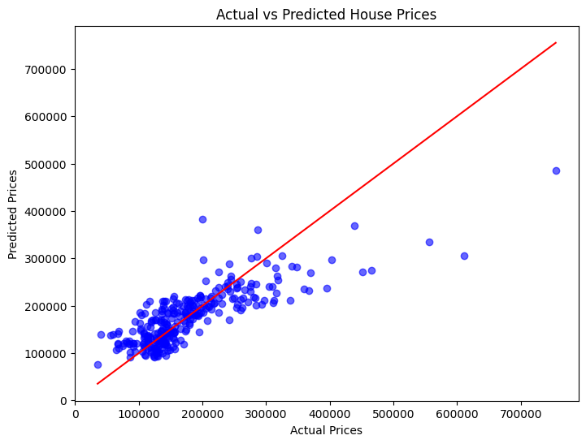

# SCT_ML_1
Machine Learning Task 1 – House Price Prediction
# 🏠 House Price Prediction 
## 📌 Problem Statement

Implement a **Linear Regression model** to predict the prices of houses based on their **square footage, number of bedrooms, and number of bathrooms**.

The objective is to build a simple predictive model that can help estimate house prices from these features.

---

## 📊 Dataset

We used the **House Prices: Advanced Regression Techniques** dataset from Kaggle:
👉 [Dataset Link](https://www.kaggle.com/c/house-prices-advanced-regression-techniques/data)

For this task, we selected relevant features:

* `GrLivArea` (Square Footage)
* `BedroomAbvGr` (Number of Bedrooms)
* `FullBath` (Number of Bathrooms)
* `SalePrice` (Target Variable)

---

## ⚙️ Steps Followed

1. **Data Loading**

   * Uploaded the dataset (`train.csv`) into Google Colab.
   * Used Pandas to load and explore the data.

2. **Data Preprocessing**

   * Selected required features.
   * Handled missing values.
   * Split data into **train** and **test** sets.

3. **Model Building**

   * Implemented a **Linear Regression model** using `sklearn`.
   * Trained on the training dataset.

4. **Evaluation**

   * Predicted house prices on test set.
   * Evaluated with **R² Score and Mean Squared Error**.

5. **Visualization**

   * Plotted graph to showcase results:

     * Actual vs Predicted Prices (scatter plot)
     

---

## ▶️ How to Run the Code

1. Open the notebook in **Google Colab**.
2. Upload the dataset CSV files into Colab’s `Files` section.
3. Run all cells sequentially.
4. The model will train and generate predictions + visualizations.

---

## 📈 Results

* The model successfully learned the relationship between **house features** and **prices**.
* Visualizations clearly show how predictions align with actual prices.

**Sample Output (Graphs):**

---

## 📦 Tech Stack

* Python
* Pandas, NumPy
* Scikit-learn
* Matplotlib, Seaborn
* Google Colab

---

## ✨ Author

**Kapil**
📍 CSE (AI & ML), Chitkara University
